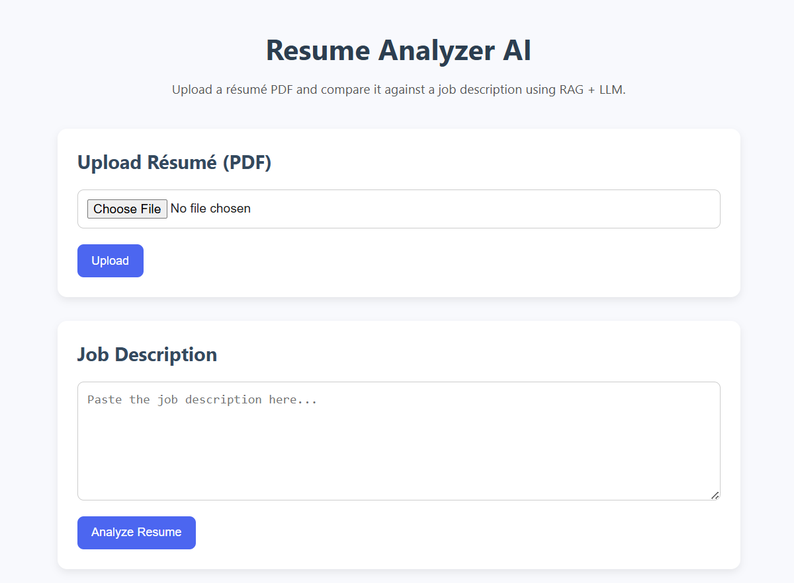

# Resume Analyzer AI

A smart web application that analyzes a résumé PDF and compares it against any job description using **RAG (Retrieval-Augmented Generation)** + **LLMs**.

Designed to help candidates instantly understand how well their résumé matches a job posting — with detailed feedback and a match score.

## UI Preview


## Features
- Upload résumé PDF and extract text automatically
- Paste job description
- Embedding-based similarity matching
- RAG-based retrieval
- LLM-powered feedback
- Match score + improvements
- Clean React UI

## Tech Stack
### Frontend
- React + Vite (TypeScript)
- Axios
- Custom CSS

### Backend
- FastAPI
- Uvicorn
- PyPDF2
- Sentence-Transformers
- Vector Store

## Project Structure
```
Resume-Analyzer-AI/
├── backend/
│   ├── app/
│   │   ├── main.py
│   │   └── services/
│   │       ├── pdf_extractor.py
│   │       ├── embedding.py
│   │       ├── vectorstore.py
│   │       ├── rag.py
│   │       └── llm.py
│   ├── requirements.txt
├── frontend/
│   ├── src/
│   │   ├── App.tsx
│   │   ├── index.tsx
│   │   └── styles.css
│   ├── index.html
│   ├── package.json
│   └── vite.config.ts
└── README.md
```

## Installation

### Backend Setup
```
cd backend
python -m venv venv
venv\Scripts\activate  # Windows
pip install -r requirements.txt
uvicorn app.main:app --reload
```

### Frontend Setup
```
cd frontend
npm install
npm run dev
```

## API Endpoints

### Upload PDF
POST /upload
Response:
```
{ "text": "Extracted résumé text..." }
```

### Analyze Resume
POST /analyze
Payload:
```
{ "job_description": "..." }
```
Response:
```
{ "similarity": "82%", "feedback": "..." }
```

## Future Enhancements
- Multi-resume comparison
- Recruiter dashboard
- AI résumé rewrite
- OAuth login
- Cloud storage support

## License
MIT
